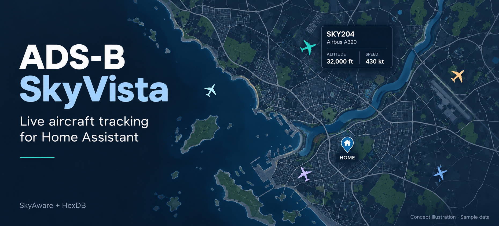

# ADS-B SkyVista

ADS-B SkyVista is a Home Assistant solution for showing live aircraft on a Lovelace map.

It includes:

- a backend integration (`flight_card`) that polls SkyAware and enriches data with HexDB
- a Lovelace custom card (`custom:flight-card`) that renders aircraft on the map
<div align="center">
   

  

</div>



## Requirements

- Home Assistant
- A reachable SkyAware endpoint (for example `http://your-skyaware-host/skyaware/data/aircraft.json`)
- HACS (recommended)

## 1. Install with HACS

ADS-B SkyVista is available in the [default HACS integration list](https://github.com/hacs/default/blob/master/integration). It is a **Home Assistant integration**, not a Supervisor add-on: do not add this repository under **Manage add-on repositories** in the add-on/app store.

If HACS is not installed yet, follow the [official HACS setup guide](https://hacs.xyz/docs/use/) first.

[](https://my.home-assistant.io/redirect/hacs_repository/?owner=aplittlecub&repository=ADS-B-SkyVista&category=integration)

1. Click the button above, or open **HACS** in the Home Assistant sidebar and search for **ADS-B SkyVista**. Its repository type is **Integration**.
2. Open **ADS-B SkyVista** and select **Download**, then confirm the download in HACS.
3. Restart Home Assistant.

The button uses My Home Assistant; set your Home Assistant instance URL there if prompted. It opens the HACS repository page, where you still need to select **Download**. If the button does not work, use the sidebar/search steps above.

## 2. Configure SkyVista

[](https://my.home-assistant.io/redirect/config_flow_start/?domain=flight_card)

1. After downloading and restarting, click the button above, or go to **Settings -> Devices & Services -> Add Integration** and search for **ADS-B SkyVista**.
2. Configure:
   - `Name`
   - `Data URL`: your actual SkyAware `aircraft.json` URL, reachable from Home Assistant (example: `http://your-skyaware-host/skyaware/data/aircraft.json`; replace the example host)
   - `Update interval (seconds)`
   - `Max aircraft age (seconds)`
   - `Enable HexDB enrichment`
3. Finish setup.
4. Confirm the **Aircraft** sensor exists in **Developer Tools -> States**. Use its actual entity ID if configuring the card's optional `entity` setting; the sensor has a `source_domain: flight_card` attribute.

To change `Data URL` later, use **Devices & Services -> ADS-B SkyVista -> Reconfigure**.
Use **Configure** (options) for polling and enrichment settings.

## 3. Add the dashboard card

1. Hard refresh the browser once (`Shift+Reload`) after adding the integration.
2. Open your dashboard and select **Edit dashboard -> Add card -> Manual**.
3. Paste the following YAML and save:

```yaml
type: custom:flight-card
title: ADS-B SkyVista
```

The integration includes and automatically loads the card, so you do not need a separate HACS dashboard/card repository or a manually added dashboard resource. The card auto-detects a compatible SkyVista sensor; optionally set `entity:` to its actual entity ID. See [Card Options](#card-options) for map height, zoom, and other settings.

## Card Options

| Option         | Type    | Default          | Description                                                      |
| -------------- | ------- | ---------------- | ---------------------------------------------------------------- |
| `title`        | string  | `ADS-B SkyVista` | Card title                                                       |
| `entity`       | string  | auto-detect      | Optional sensor entity created by the ADS-B SkyVista integration |
| `map_height`   | number  | `420`            | Map height in px                                                 |
| `map_theme`    | string  | `auto`           | Basemap palette: `auto`, `light`, or `dark`                        |
| `default_zoom` | number  | `8`              | Initial zoom                                                     |
| `fit_bounds`   | boolean | `true`           | Auto-fit map to aircraft once per load                           |
| `center_lat`   | number  | `null`           | Optional initial center latitude (manual override)               |
| `center_lon`   | number  | `null`           | Optional initial center longitude (manual override)              |
| `tile_url`     | string  | OSM              | Map tile URL                                                     |
| `attribution`  | string  | OSM              | Tile attribution                                                 |

If `center_lat`/`center_lon` are not set, the card centers automatically from Home Assistant location data (`zone.home`, then HA core location).

The header's **Auto / Light / Dark** control changes the map palette immediately for that card. **Auto** follows Home Assistant's active light/dark mode, falling back to the browser's system preference if HA does not supply a mode. Header choices last until the card reloads or its configuration changes; they do not modify the dashboard. Save a preferred default using **Map theme** in the card editor or YAML:

```yaml
type: custom:flight-card
map_theme: dark
```

Dark mode adjusts the existing basemap with a colour filter. Aircraft altitude colours, popup contents, photos, controls, and attribution retain their original colours. The map keeps its position, zoom, open popup, and cached tiles when switching modes. Tile provider, attribution, referrer policy, and caching are unchanged. For a custom provider with its own dark palette, choose `light` to leave those tiles unfiltered.

## Aircraft Icon Mapping

| SVG           | Preview                                                                     | Matching rules                                                                                              |
| ------------- | --------------------------------------------------------------------------- | ----------------------------------------------------------------------------------------------------------- |
| `a0.svg`      |            | Direct emitter category `A0`                                                                                |
| `a1.svg`      |            | Direct emitter category `A1`                                                                                |
| `a2.svg`      |            | Direct emitter category `A2`                                                                                |
| `a3.svg`      |            | Direct emitter category `A3`                                                                                |
| `a320.svg`    |        | `startsWith("A32")` or `A318 A319 A320 A321 A20N A21N`                                                      |
| `a330.svg`    |        | `startsWith("A33")` or `A300 A306 A310 A332 A333 A339`                                                      |
| `a340.svg`    |        | `startsWith("A34")` or `startsWith("A35")` or `A340 A350 A359 A35K`                                         |
| `a380.svg`    |        | `startsWith("A38")` or `A380 A388`                                                                          |
| `a4.svg`      |            | Direct emitter category `A4`                                                                                |
| `a5.svg`      |            | Direct emitter category `A5`                                                                                |
| `a6.svg`      |            | Direct emitter category `A6`                                                                                |
| `a7.svg`      |            | Direct emitter category `A7` or `A7 F3 F03 EC35 EC45 H145`                                                  |
| `b0.svg`      |            | Direct emitter category `B0` or `B0 B5 B6 B7 F13`                                                           |
| `b1.svg`      |            | Direct emitter category `B1` or `B1 F1 F01 ULM ULTRALIGHT`                                                  |
| `b2.svg`      |            | Direct emitter category `B2` or `B2 F12`                                                                    |
| `b3.svg`      |            | Direct emitter category `B3` or `B3 F4 F04`                                                                 |
| `b4.svg`      |            | Direct emitter category `B4` or `B4 F6 F7 F06 F07`                                                          |
| `b737.svg`    |        | `startsWith("B73")`, `startsWith("B38")`, `startsWith("B39")`, or `B727 B737 B738 B739 B37M B38M B39M`      |
| `b747.svg`    |        | `startsWith("B74")` or `B741 B742 B743 B744 B748`                                                           |
| `b767.svg`    |        | `startsWith("B76")` or `B761 B762 B763 B764 B767`                                                           |
| `b777.svg`    |        | `startsWith("B77")` or `B772 B773 B77L B77W`                                                                |
| `b787.svg`    |        | `startsWith("B78")` or `B788 B789 B78X`                                                                     |
| `c0.svg`      |            | Direct emitter category `C0` or `C0 C1 C2 C3`                                                               |
| `c130.svg`    |        | `startsWith("C13")`, `startsWith("C30")`, or `C130 C135 C17`                                                |
| `cessna.svg`  |    | `startsWith("C15")`, `startsWith("C17")`, `startsWith("C18")`, `startsWith("C20")`, or `startsWith("CESS")` |
| `crjx.svg`    |        | `startsWith("CRJ")` or `CRJ1 CRJ2 CRJ7 CRJ9 CRJX`                                                           |
| `dh8a.svg`    |        | `startsWith("DH8")`, `startsWith("AT7")`, `startsWith("AT4")`, or `DHC8`                                    |
| `e195.svg`    |        | `startsWith("E17")`, `startsWith("E19")`, or `E170 E175 E190 E195`                                          |
| `erj.svg`     |          | `startsWith("E13")`, `startsWith("E14")`, or `ERJ E135 E145`                                                |
| `f100.svg`    |        | `startsWith("F10")`, `startsWith("MD8")`, or `F100 MD80 MD81 MD82 MD83 MD87 MD88`                           |
| `f11.svg`     |          | `F11`                                                                                                       |
| `f15.svg`     |          | `F15`                                                                                                       |
| `f5.svg`      |            | `F5 F05`                                                                                                    |
| `fa7x.svg`    |        | `startsWith("FA7")`, `startsWith("FA8")`, or `E35L`                                                         |
| `glf5.svg`    |        | `startsWith("GLF")`, `startsWith("G5")`, `startsWith("G6")`, or `GLEX`                                      |
| `learjet.svg` |  | `startsWith("C25")`, `startsWith("LJ")`, or `startsWith("LEAR")`                                            |
| `md11.svg`    |        | `startsWith("MD11")` or `MD11`                                                                              |

Matching order matters: first match wins in `iconFromTypeToken`.

## Integration Options

| Option            | Type    | Default                | Description                                        |
| ----------------- | ------- | ---------------------- | -------------------------------------------------- |
| `data_url`        | string  | demo URL shown in form | SkyAware endpoint                                  |
| `update_interval` | number  | `10`                   | Poll interval (seconds)                            |
| `max_age`         | number  | `60`                   | Max `seen` age in seconds                          |
| `hexdb_enabled`   | boolean | `true`                 | Enrich data with HexDB metadata and airframe image |

## Troubleshooting

- If adding the repository shows an add-on/app repository error, use **HACS** in the sidebar instead of **Manage add-on repositories**. Follow [1. Install with HACS](#1-install-with-hacs).
- If the card says `Entity not found`, set `entity:` to the exact sensor ID from Developer Tools.
- If the card does not appear in card picker, hard refresh browser (`Shift+Reload`) after restarting Home Assistant.
- If the map is empty but sensor has data, confirm the module URL returns `200`: `http://<HA_HOST>:8123/flight_card/flight-card.js`.
- If the integration does not appear, restart Home Assistant after installation.
- If the sensor is unavailable, verify Home Assistant can reach your `data_url`.

### If ADS-B SkyVista is missing from HACS search

Clear any HACS filters that hide available integrations and try the button in [1. Install with HACS](#1-install-with-hacs). A custom repository is normally unnecessary because ADS-B SkyVista is in the default list. If it is still missing, use the [HACS custom repository fallback](https://hacs.xyz/docs/faq/custom_repositories/):

1. Open **HACS** in the sidebar, select the **three-dot menu -> Custom repositories**.
2. Enter `https://github.com/aplittlecub/ADS-B-SkyVista` and select type **Integration**.
3. Select **Add**, then search for **ADS-B SkyVista** and continue from step 2 of [1. Install with HACS](#1-install-with-hacs).

<details>
<summary>Manual / local installation without HACS</summary>

If you are not using HACS:

1. Download and extract this repository from [GitHub](https://github.com/aplittlecub/ADS-B-SkyVista), then copy the entire `custom_components/flight_card` folder (including `flight-card.js`) into your Home Assistant configuration directory (`/config/custom_components/flight_card` on Home Assistant OS).
2. Restart Home Assistant.
3. Follow [2. Configure SkyVista](#2-configure-skyvista) to add **ADS-B SkyVista** in **Settings -> Devices & Services**.
4. Follow [3. Add the dashboard card](#3-add-the-dashboard-card), including the browser refresh. The bundled card is automatically loaded with this installation method too.

</details>

## Licensing & Attribution (Final Published - v0.3.2)

ADS-B SkyVista source code is published under **MIT** (see [`LICENSE`](LICENSE)).

Third-party assets/services used by this release:

| Component                                  | License / Terms                                                                   | Required / Recommended attribution                                                                                |
| ------------------------------------------ | --------------------------------------------------------------------------------- | ----------------------------------------------------------------------------------------------------------------- |
| Leaflet (`leaflet` v1.9.4)                 | BSD 2-Clause                                                                      | Keep Leaflet license in redistribution/docs when required (`node_modules/leaflet/LICENSE`)                        |
| OpenStreetMap tiles/data (default layer)   | OSM attribution policy                                                            | **Required:** `© OpenStreetMap contributors` with link to https://www.openstreetmap.org/copyright                 |
| ADS-B Radar aircraft SVG icon pack         | Free for personal/commercial use with backlink requirement (per icon pack readme) | **Required:** `Icons by ADS-B Radar for macOS - https://adsb-radar.com - https://apps.apple.com/app/id1538149835` |
| HexDB lookup API + airframe image endpoint | Service usage terms at provider                                                   | **Recommended:** `Aircraft metadata and airframe image lookup by HexDB - https://hexdb.io`                        |

HexDB endpoints used by this project:

- `https://hexdb.io/api/v1/aircraft/{hex}`
- `https://hexdb.io/hex-image-thumb?hex={hex}`

```text
Map data © OpenStreetMap contributors (https://www.openstreetmap.org/copyright)
Icons by ADS-B Radar for macOS - https://adsb-radar.com - https://apps.apple.com/app/id1538149835
Aircraft metadata and airframe image lookup by HexDB - https://hexdb.io
```

## Developer Notes

- Local test stack: `docker compose -f docker-compose.home-assistant.yml up -d`
- Dev container setup is included in `.devcontainer/`
- Build commands:
  - `npm ci`
  - `npm run check`
  - `npm run build`
  - `npm run build:watch`

Both build commands synchronize `flight-card.js` and its source map from `dist/` into
`custom_components/flight_card/`, the package installed by HACS. Commit the rebuilt
files with source changes. `npm run check:bundle` compares both destinations with a
fresh build without overwriting them and fails on stale or missing artifacts.

Regression checks: `npm run test:package`, then `npx playwright install chromium`
and `npm run test:frontend`. To use an existing Chromium browser, set
`PLAYWRIGHT_CHROMIUM_EXECUTABLE_PATH` to its executable. Browser tests use synthetic
HA state and tile responses and never contact tile providers. The backend tests use
Python 3.14: install `tests/requirements.txt` in an isolated environment, then run
`python -m unittest discover -s tests -p 'test_*.py' -v`. They exercise actual HA
entity exclusion metadata and Recorder serialization/SQLite models, with a synthetic
coordinator and events; they do not start a Recorder worker or validate a live HA server.

The sensor publishes aircraft count and small metadata, including `config_entry_id`
and `updated`. Geometry stays in the coordinator cache and is served through HA's
authenticated `flight_card/get_geojson` WebSocket command. Requests require read
permission for the integration's actual Aircraft entity and never poll the receiver.
Aircraft-count states and small attributes remain available in history.

The card refreshes on source updates and reconnects, discards superseded responses,
and clears stale aircraft when its source becomes unavailable. Choose an explicit
`entity` when more than one eligible aircraft sensor exists.

An open aircraft popup follows the same aircraft as its position and telemetry change.
Identity uses its normalized hex address (or an explicit GeoJSON feature ID when no
hex is available), never list position or callsign. If the aircraft disappears or its
identity becomes ambiguous, its popup closes and does not reopen automatically.
The Live pill stays stable during routine refreshes. It changes to Stale after the
snapshot's source timestamp is more than 30 seconds old, even without a new HA event;
an old cached response does not reset that age. Disconnects, unavailable sources, and
permission failures remain explicit errors. Transient refresh failures retain the
last known snapshot and its true age.

Legacy and custom combined/template entities that supply a GeoJSON FeatureCollection
in their `geojson` attribute remain supported; inline data takes precedence even if
they also carry a source `config_entry_id`. Templates that previously copied the
native sensor's `geojson` attribute must be migrated: that native attribute no longer
exists. A single-source alias can carry the native `config_entry_id` and `updated`;
an external combined-data producer must continue supplying its own inline GeoJSON.
This command returns one entry's snapshot and does not aggregate multiple receivers.

If `custom:flight-card` does not register after restarting HA and refreshing the
dashboard, collect the first browser console error, the SkyVista version banner,
and the status/body of `/flight_card/flight-card.js`. Include HA/SkyVista/browser
versions and whether a private window reproduces it. Also record the read-only
console result of `typeof customElements.get('flight-card')`. A successful download
or version banner does not prove the definition survived HA's startup registry
replacement. The card now waits for HA's root element to be defined before declaring
and registering its class, ensuring it uses HA's final element registry and base
class. Standalone previews retain immediate registration.
See [issue 2](https://github.com/aplittlecub/ADS-B-SkyVista/issues/2).

## References

- Home Assistant custom cards: https://developers.home-assistant.io/docs/frontend/custom-ui/custom-card/
- Home Assistant frontend data model: https://developers.home-assistant.io/docs/frontend/data/
- Home Assistant data fetching best practices: https://developers.home-assistant.io/docs/integration_fetching_data/
- HACS publish guidance: https://www.hacs.xyz/docs/publish/include/
